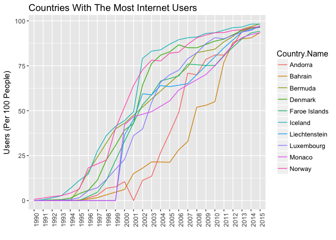

# Internet Users
Andrew Ehsaei  
February 16, 2017  

## Project
Visualization of Internet Users Over Time: https://aehsaei.github.io/P6_Make_Effective_Data_Visualization/

JSFiddle of Visualization: https://jsfiddle.net/aehsaei/c91dzhn9/

## Abstract
In this project I'll be creating an interactive data visualization using
HTML, CSS, JavaScript, and D3. The dataset I am exploring contains the numbers of 
Internet Users in each country over time.

## Introduction
First, I will download the dataset from the World Bank website
( http://data.worldbank.org/indicator/IT.NET.USER.P2 ). I'll start to explore the 
data using R and create some basic plots using ggplot to look for interesting 
trends. The README.md will contain details on creating the visualization.

## Summary
In this visualization I wanted to show the overall trend in the amount of people using the internet across the world. I would also like to show that the United States, although much higher than the average, is not at the top of the list. There are many countries that have a higher percentage of people that use the internet over the United States. It is also interesting to see the leveling out of the curve for the United States, and the temporary decreases after around 2006.

## Design
The data involves a time series, so I decided to plot the data using a line chart. There are many countries included in the dataset, each representing a separate line. In order to focus the reader, I added 3 buttons to narrow the focus to a few points of comparison. I wanted to compare the trend of the United States (the place where the internet started), to the world average and to the top of the list. I did this by adding buttons to highlight these particular lines in the chart and allow for an easy comparison. I also added the ability to mouse-over any line to get the country name and most recent user data as a popup. 

## Feedback
Feedback #1:
I first plotted all the data using dimple.js and the result was a large number of lines in many different colors. The feedback here was that the lines looked a bit overwhelming and it was hard to focus on any particular trend within the plot. I decided to initially plot each line in a neutral color, and have the ability to scroll over each line to highlight the line and associated country. 

Feedback #2:
I then placed a few buttons for different regions: North America, Asia, Africa, etc... and before I put the functionality to selectively plot these regions I got feedback on the layout. The feedback received was that it lacked an interesting relationship. The test plots showed a relationship that was expected between the different regions. And with color-coded regions, the plot lacked focus and the colors were distracting. I decided to focus on the United States and show this trend in relation to the average, and to the country with the highest user percentage. I think many would expect the United States to be at or near the top of this list. Although the US is much higher than the average, there are many more countries that have a higher percentage of people that use the internet.

Feedback #3:
I replaced the buttons at the top to focus on the United States and sought feedback on this version. The feedback received was that the user data needed to be displayed somewhere on the plot. I decided to add this information to the pop-up text box that would appear when scrolling over a particular line.  

# Files
Internet.js : (Submission) Javascript file containing D3 code <br>
Internet.html : (Submission) HTML file <br>
Internet.css : (Submission) CSS file <br>
InternetUsersDataDimple.html : First chart using Dimple <br>
DimpleGraph.png : Dimple chart <br>
InternetUsersDataFixedSmall.csv : Fixed format small set for testing <br>
InternetUsersDataFixed.csv : Fixed format set <br>
InternetUsersData.csv : Full dataset downloaded from World Bank <br>
P6_Make_An_Effective_Visualization.Rmd : R code + tidy data code <br>
P6_Make_An_Effective_Visualization.html : HTML report for Rmd

## Import the Data


```r
# Import the dataset into a dataframe variable
mydata <- read.csv('/Users/aehsaei/Documents/Udacity/Project_6/InternetUsersData.csv', row.names=NULL)
```

## Tidy Data

```r
# Drop the Indicator.Name column (not needed)
mydata <- mydata[ , !(names(mydata) %in% c("Country.Code", "Indicator.Name"))]

# Change the 'Year' columns to row values
mydata <- melt(mydata, id=(c("Country.Name", "Indicator.Code")))

# Add column names to these new aggregated columns
colnames(mydata) <- c("Country.Name", "Indicator.Code", "Year", "Users")

# Remove the leading 'X' in front of the years
mydata["Year"] <- lapply(mydata["Year"], function(x) { gsub("X", "", x) })

# Change all 'NA' values to 0 in the Users column
mydata$Users[which(is.na(mydata$Users))] <- 0

# Print the transformed dataframe
str(mydata, strict.width = "cut", indent.str = "  " )
```

```
## 'data.frame':	14784 obs. of  4 variables:
##   $ Country.Name  : Factor w/ 264 levels "Afghanistan",..: 11 5 1 6 2 8 2..
##   $ Indicator.Code: Factor w/ 1 level "IT.NET.USER.P2": 1 1 1 1 1 1 1 1 1..
##   $ Year          : chr  "1960" "1960" "1960" "1960" ...
##   $ Users         : num  0 0 0 0 0 0 0 0 0 0 ...
```


```r
# Find internet history of USA
subset(mydata, mydata$Country.Name == "United States" & mydata$Users > 0)
```

```
##        Country.Name Indicator.Code Year      Users
## 8169  United States IT.NET.USER.P2 1990  0.7847285
## 8433  United States IT.NET.USER.P2 1991  1.1631937
## 8697  United States IT.NET.USER.P2 1992  1.7242025
## 8961  United States IT.NET.USER.P2 1993  2.2716733
## 9225  United States IT.NET.USER.P2 1994  4.8627806
## 9489  United States IT.NET.USER.P2 1995  9.2370883
## 9753  United States IT.NET.USER.P2 1996 16.4193530
## 10017 United States IT.NET.USER.P2 1997 21.6164010
## 10281 United States IT.NET.USER.P2 1998 30.0931966
## 10545 United States IT.NET.USER.P2 1999 35.8487245
## 10809 United States IT.NET.USER.P2 2000 43.0791626
## 11073 United States IT.NET.USER.P2 2001 49.0808316
## 11337 United States IT.NET.USER.P2 2002 58.7854039
## 11601 United States IT.NET.USER.P2 2003 61.6971171
## 11865 United States IT.NET.USER.P2 2004 64.7582565
## 12129 United States IT.NET.USER.P2 2005 67.9680529
## 12393 United States IT.NET.USER.P2 2006 68.9311933
## 12657 United States IT.NET.USER.P2 2007 75.0000000
## 12921 United States IT.NET.USER.P2 2008 74.0000000
## 13185 United States IT.NET.USER.P2 2009 71.0000000
## 13449 United States IT.NET.USER.P2 2010 71.6900000
## 13713 United States IT.NET.USER.P2 2011 69.7294608
## 13977 United States IT.NET.USER.P2 2012 74.7000000
## 14241 United States IT.NET.USER.P2 2013 71.4000000
## 14505 United States IT.NET.USER.P2 2014 73.0000000
## 14769 United States IT.NET.USER.P2 2015 74.5500000
```

```r
# Find first year with non-zero internet user data
subset(mydata, mydata$Users > 0)["Year"][1,]
```

```
## [1] "1990"
```

```r
# Remove all data before first year with non-zero values
mydata <- subset(mydata, mydata$Year >= 1990)

# Find top 10 countries with highest 'Users' in 2015
top_10_countries <- subset(mydata, mydata$Users > 0 & mydata$Year == 2015) %>%
  arrange(desc(Users)) %>%
  head(10)

top_10_countries
```

```
##     Country.Name Indicator.Code Year    Users
## 1        Bermuda IT.NET.USER.P2 2015 98.32361
## 2        Iceland IT.NET.USER.P2 2015 98.20000
## 3     Luxembourg IT.NET.USER.P2 2015 97.33410
## 4        Andorra IT.NET.USER.P2 2015 96.91000
## 5         Norway IT.NET.USER.P2 2015 96.81030
## 6  Liechtenstein IT.NET.USER.P2 2015 96.64120
## 7        Denmark IT.NET.USER.P2 2015 96.33050
## 8  Faroe Islands IT.NET.USER.P2 2015 94.20000
## 9        Bahrain IT.NET.USER.P2 2015 93.47830
## 10        Monaco IT.NET.USER.P2 2015 93.36330
```

```r
# Find lowest 10 countries with highest 'Users' in 2015
bottom_10_countries <- subset(mydata, mydata$Users > 0 & mydata$Year == 2015) %>%
  arrange(desc(Users)) %>%
  tail(10)

bottom_10_countries
```

```
##                 Country.Name Indicator.Code Year    Users
## 239                   Guinea IT.NET.USER.P2 2015 4.700000
## 240 Central African Republic IT.NET.USER.P2 2015 4.563264
## 241               Madagascar IT.NET.USER.P2 2015 4.173972
## 242         Congo, Dem. Rep. IT.NET.USER.P2 2015 3.800000
## 243            Guinea-Bissau IT.NET.USER.P2 2015 3.540707
## 244                     Chad IT.NET.USER.P2 2015 2.700000
## 245             Sierra Leone IT.NET.USER.P2 2015 2.500000
## 246                    Niger IT.NET.USER.P2 2015 2.220165
## 247                  Somalia IT.NET.USER.P2 2015 1.760000
## 248                  Eritrea IT.NET.USER.P2 2015 1.083733
```


```r
# Plot top 10
ggplot(data = subset(mydata, 
                     mydata$Country.Name %in% top_10_countries$Country.Name), 
       aes(x=Year, y=Users, group=Country.Name, colour=Country.Name)) +
  geom_line() +
  ggtitle("Countries With The Most Internet Users") +
  labs(x="", y="Users (Per 100 People)") +
  theme(text = element_text(size=12),
        axis.text.x = element_text(angle=90, hjust=1))
```

<!-- -->

```r
# Plot bottom 10
ggplot(data = subset(mydata, 
                     mydata$Country.Name %in% bottom_10_countries$Country.Name), 
       aes(x=Year, y=Users, group=Country.Name, colour=Country.Name)) +
  geom_line() +
  ggtitle("Countries With The Least Internet Users") +
  labs(x="", y="Users (Per 100 People)") +
  theme(text = element_text(size=12),
        axis.text.x = element_text(angle=90, hjust=1))
```

<!-- -->

```r
# Plot all
ggplot(data = mydata, aes(x=Year, y=Users, group=Country.Name)) +
  geom_line() +
  ggtitle("Internet Users (All Countries)") +
  labs(x="", y="Users (Per 100 People)") +
  theme(text = element_text(size=12),
        axis.text.x = element_text(angle=90, hjust=1))
```

<!-- -->

## Output Tidied Data

```r
write.csv(file='/Users/aehsaei/Documents/Udacity/Project_6/InternetUsersDataFixed.csv', x=mydata)
```

#Resources
https://bl.ocks.org/d3noob <br>
http://learnjsdata.com/group_data.html <br>
http://jsfiddle.net/maniator/Bvmgm/6/ <br>
https://apandre.files.wordpress.com/2011/02/ chartchooserincolor.jpg <br>
http://www.nikhil-nathwani.com/projects/saviors/saviors.html <br>
